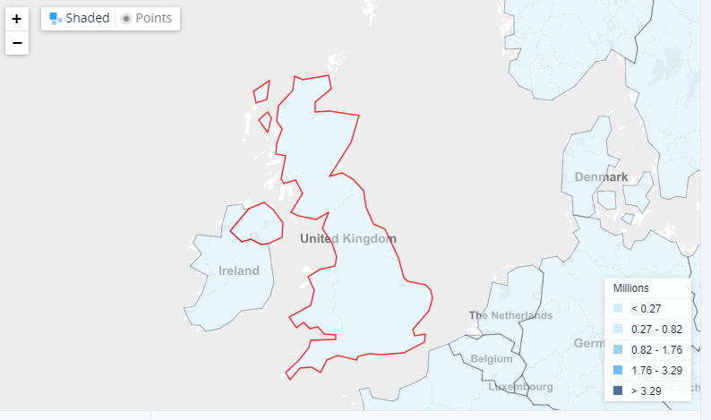
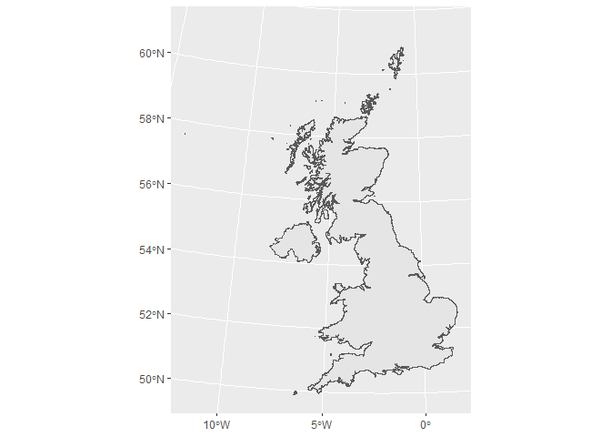
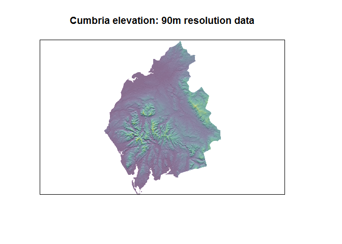
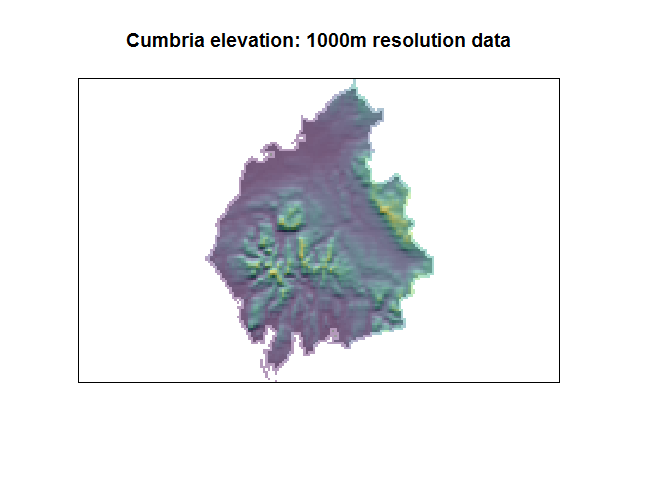
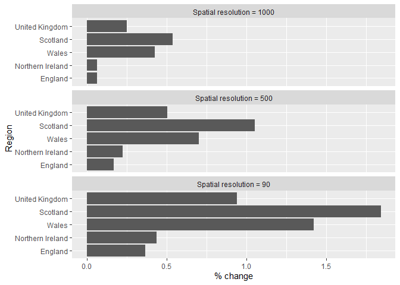

UK Surface Area
================
Laura J. Graham
17/06/2020

``` r
library(raster)
library(sf)
library(tidyverse)
library(viridis)
```

# Background

<blockquote class="twitter-tweet" data-partner="tweetdeck">

<p lang="en" dir="ltr">

Sorry if this is a silly question: does anyone know who is in charge of
calculating the surface area of the UK? I can see values online of both
243,610 km^2 and 242,495 km^2 but cannot find where they come from. Is
this an <a href="https://twitter.com/ONS?ref_src=twsrc%5Etfw">@ONS</a>
job? Or someone over at
<a href="https://twitter.com/DefraStats?ref_src=twsrc%5Etfw">@DefraStats</a>?

</p>

— Matt Parker (@standupmaths)
<a href="https://twitter.com/standupmaths/status/1272856901374672901?ref_src=twsrc%5Etfw">June
16, 2020</a>

</blockquote>

<script async src="https://platform.twitter.com/widgets.js" charset="utf-8"></script>

  - How is the surface area of the UK calculated?
  - Why are there (at least) two different figures available online?
  - Is the calculation based on planimetric features, or is elevation
    (i.e. the true surface area) taken into account?

# World bank calculation

Surface area for the UK of 243,610. Limited information about
calculation, but the shapefile used is not as accurate as the one I’m
using from GADM. Calculation information:

> Surface area is a country’s total area, including areas under inland
> bodies of water and some coastal waterways.



# Planimetric surface area

``` r
# shapefile broken up by country
uk_countries <- getData(name = "GADM", 
                        country = "GBR", 
                        level = 1) %>% 
  st_as_sf() %>% 
  st_transform("EPSG:27700") %>% # British National Grid
  select(name = NAME_1)

cumbria <- getData(name = "GADM", 
                       country = "GBR", 
                       level = 2) %>% 
  st_as_sf() %>% 
  st_transform("EPSG:27700") %>% # British National Grid
  filter(NAME_2 == "Cumbria")

# dissolved shapefile for whole UK
uk_shp <- getData(name = "GADM", country = "GBR", level = 0) %>% 
  st_as_sf() %>% 
  st_transform("EPSG:27700") %>% # British National Grid
  select(name = NAME_0)

st_area(uk_shp) %>% units::set_units(km^2)
```

    ## 245415 [km^2]

``` r
ggplot(uk_shp) + 
  geom_sf()
```

<!-- -->

Okay, so this is higher than either of the figures Matt Parker found…
this is likely to be an issue with how detailed the underlying
shapefiles being used are, or if raster data the spatial resolution. The
shapefile I have used is much more detailed and includes some of the
Scottish islands which are missed off in the world bank calculation.

# Surface calculation with DEM data

Elevation data was extracted from Google Earth Engine at 3 resolutions
using
[`extract_elevation`](https://code.earthengine.google.com/f564497cdfdbe45cfbbe8030ab30a808).
The [UK shapefile from
GADM](https://code.earthengine.google.com/?asset=users/LauraJaneEGraham/UK_countries)
will also be needed. This uses the 90m resolution [SRTM Digital
Elevation Data
Version 4](https://developers.google.com/earth-engine/datasets/catalog/CGIAR_SRTM90_V4),
and is aggregated to 500m and 1000m and reprojected to British National
Grid.

``` r
plot_rasters <- function(res) {
  fname <- list.files("~/Google Drive/surface_area/", 
                      pattern = as.character(res), 
                      full.names = TRUE)
  elev <- raster(fname)
  elev <- crop(elev, cumbria)
  elev <- mask(elev, cumbria)
  slope <- terrain(elev, opt = "slope")
  aspect <- terrain(elev, opt = "aspect")
  hill <- hillShade(slope, aspect)
  
  plot(hill,
    col=grey(1:100/100),  #create a color ramp of grey colors
    legend=FALSE,
    main=paste0("Cumbria elevation: ", res, "m resolution data"),
    axes=FALSE)

  # add the DSM on top of the hillshade
  plot(elev,
       col=viridis(100),
       alpha=0.4,
       add=TRUE,
       legend=FALSE)
}

plot_rasters(90)
```

<!-- -->

``` r
plot_rasters(500)
```

<!-- -->

``` r
plot_rasters(1000)
```

<!-- -->

DEM-based surface areas were calculated using `sp::surfaceArea`. A
method based on [Calculating Landscape Surface Area from Digital
Elevation Models, Jeff S. Jenness Wildlife Society Bulletin, Vol. 32,
No. 3 (Autumn, 2004),
pp. 829-839](https://www.fs.usda.gov/treesearch/pubs/20437)

> This paper describes a straightforward method of calculating
> surface-area grids directly from digital elevation models (DEMs), by
> generating 8 3-dimensional triangles connecting each cell centerpoint
> with the centerpoints of the 8 surrounding cells, then calculating and
> summing the area of the portions of each triangle that lay within the
> cell boundary.

``` r
calc_surface <- function(res, shp) {
  dem_f <- list.files("~/Google Drive/surface_area/", 
                      pattern = as.character(res), 
                      full.names = TRUE)
  dem_ras <- raster(dem_f)
  dem_ras <- crop(dem_ras, shp)
  dem_ras <- mask(dem_ras, shp)
  dem_mat <- as.matrix(dem_ras)
  
  dem_surface <- surfaceArea(dem_mat, 
                             cellx = res, 
                             celly = res, 
                             byCell = TRUE)
  
  area_name <- shp %>% pull(name)
  
  out <- tibble(Region = area_name, 
                surface_dem = sum(dem_surface,
                                  na.rm = TRUE)/1e+06, 
                surface_flat = st_area(shp) %>% 
                  units::set_units(km^2) %>% 
                  as.numeric(), 
                `Spatial resolution` = res)
}

out <- list()
for (res in c(90, 500, 1000)) {
  temp <- list()
  for (i in 1:4) {
    temp[[i]] <- calc_surface(res, uk_countries[i,])
  }
  temp[[i + 1]] <- calc_surface(res, uk_shp)
  out[[res]] <- do.call(rbind, temp)
}

out <- do.call(rbind, out)

out <- out %>% 
  mutate(`% change` = ((surface_dem - surface_flat)/surface_flat)*100) %>% 
  rename(`Surface area (DEM)` = surface_dem,
         `Surface area (flat)` = surface_flat)

out
```

<div class="kable-table">

| Region           | Surface area (DEM) | Surface area (flat) | Spatial resolution |  % change |
| :--------------- | -----------------: | ------------------: | -----------------: | --------: |
| England          |          131270.58 |           130790.55 |                 90 | 0.3670279 |
| Northern Ireland |           14167.35 |            14105.90 |                 90 | 0.4356320 |
| Scotland         |           81094.73 |            79629.25 |                 90 | 1.8403782 |
| Wales            |           21186.42 |            20889.26 |                 90 | 1.4225610 |
| United Kingdom   |          247719.34 |           245414.96 |                 90 | 0.9389740 |
| England          |          131010.48 |           130790.55 |                500 | 0.1681538 |
| Northern Ireland |           14137.70 |            14105.90 |                500 | 0.2254332 |
| Scotland         |           80467.76 |            79629.25 |                500 | 1.0530182 |
| Wales            |           21036.01 |            20889.26 |                500 | 0.7025346 |
| United Kingdom   |          246652.59 |           245414.96 |                500 | 0.5043028 |
| England          |          130877.05 |           130790.55 |               1000 | 0.0661420 |
| Northern Ireland |           14115.05 |            14105.90 |               1000 | 0.0648362 |
| Scotland         |           80058.49 |            79629.25 |               1000 | 0.5390441 |
| Wales            |           20978.02 |            20889.26 |               1000 | 0.4249251 |
| United Kingdom   |          246029.26 |           245414.96 |               1000 | 0.2503108 |

</div>

In the R package documentation for `sp::surfaceArea` they say:

> It is often said that if Wales was flattened out it would have an area
> bigger than England.

This is clearly nonsense. But Wales and Scotland do have higher
percentage increase when taking into account elevation.

Based on these figures, we can conclude that surface area is calculated
based on planimetric features, rather than taking elevation into
account.

``` r
out <- out %>% 
  gather(key, value, -Region, -`Spatial resolution`, -`% change`) %>% 
  mutate(Region = factor(Region, 
                         levels = c("England", 
                                    "Northern Ireland", 
                                    "Wales", 
                                    "Scotland", 
                                    "United Kingdom")),
         `Spatial resolution` = paste0("Spatial resolution = ", 
                                       `Spatial resolution`))

ggplot(out, aes(x = Region, y = `% change`)) + 
  geom_bar(stat = "identity", position = "dodge") + 
  facet_wrap(~`Spatial resolution`, ncol = 1) + 
  coord_flip()
```

<!-- -->
